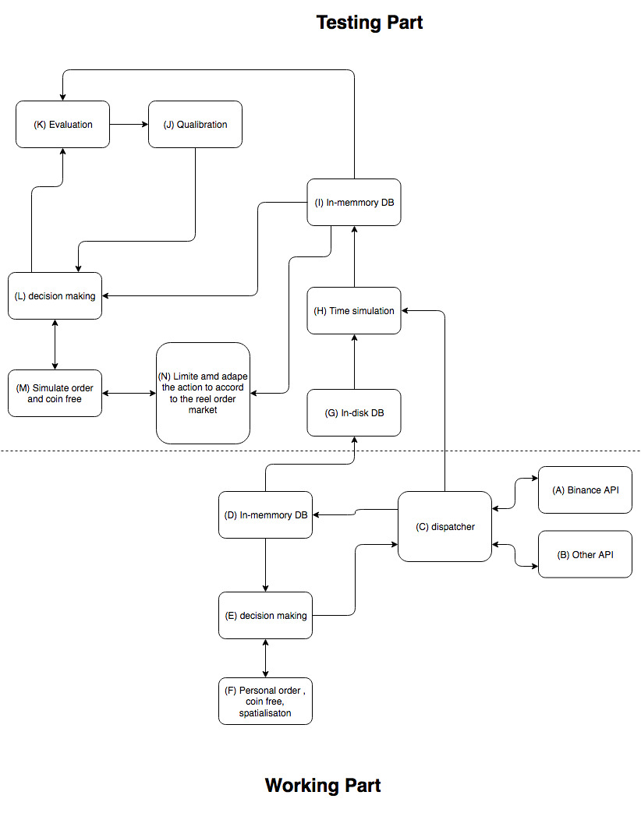

# description
Ce projet est composer de deux partie distinct: L'une est fonctionel et conecter aux platforme d'echange; l'autre permet de simuler, visualiser et qualibrer des strategie sur l'ensemble des donner collecter don celle en temps reel.

# Resource
## Math/algo:
  - [Using OpenCL for Implementing Simple  Parallel Graph Algorithms](http://citeseerx.ist.psu.edu/viewdoc/download?doi=10.1.1.218.1743&rep=rep1&type=pdf)
  - [Parallel Graph Algorithms](https://www8.cs.umu.se/kurser/5DV050/VT10/handouts/F10.pdf)
  - [distributions à queue épaisse](https://sciencetonnante.wordpress.com/2011/05/30/pourquoi-les-marches-financiers-fluctuent-ils-tous-de-la-meme-maniere/#more-1509)
  - [(MIT) Mathematics for Computer Science](https://ocw.mit.edu/courses/electrical-engineering-and-computer-science/6-042j-mathematics-for-computer-science-fall-2010/readings/MIT6_042JF10_notes.pdf)
  - [(MIT) Introduction to Networks](https://ocw.mit.edu/courses/sloan-school-of-management/15-053-optimization-methods-in-management-science-spring-2013/lecture-notes/MIT15_053S13_lec15.pdf)
  - [(MIT) Covariance and Correlation](https://ocw.mit.edu/courses/mathematics/18-05-introduction-to-probability-and-statistics-spring-2014/readings/MIT18_05S14_Reading7b.pdf)

  - some other stuff related
  - [Unofficial Andrew Ng course notes](http://www.holehouse.org/mlclass/)
  - [Tom Mitchell Machine Learning Lectures](http://www.cs.cmu.edu/~ninamf/courses/601sp15/lectures.shtml)
  - [(MIT) What is Artificial Intelligence (AI)?](https://ocw.mit.edu/courses/electrical-engineering-and-computer-science/6-825-techniques-in-artificial-intelligence-sma-5504-fall-2002/lecture-notes/Lecture1Final.pdf)
  - [Deep Learning in PyTorch](https://iamtrask.github.io/2017/01/15/pytorch-tutorial/)
  - [(MIT) Central Limit Theorem and the Law of Large Numbers](https://ocw.mit.edu/courses/mathematics/18-05-introduction-to-probability-and-statistics-spring-2014/readings/MIT18_05S14_Reading6b.pdf)
  - [(MIT) Value At Risk (VAR) Models](https://ocw.mit.edu/courses/mathematics/18-s096-topics-in-mathematics-with-applications-in-finance-fall-2013/lecture-notes/MIT18_S096F13_lecnote7.pdf)
  - [(MIT) Continuous Random Variables](https://ocw.mit.edu/courses/mathematics/18-05-introduction-to-probability-and-statistics-spring-2014/readings/MIT18_05S14_Reading5b.pdf)

## Thecno informatique:
  - [binance api IN USE](https://github.com/binance-exchange/binance-api-node/)
  - [binance api SOON in use](https://github.com/binance-exchange/node-binance-api)

  - [in-memmory DB (noSQL)](https://redis.io/documentation)
  - [in-disck DB (noSQL)](https://docs.mongodb.com/)
  - [Caching a MongoDB Database with Redis](https://www.sitepoint.com/caching-a-mongodb-database-with-redis/)
  - [How to Use MongoDB as a Pure In-memory DB (Redis Style) ](https://dzone.com/articles/how-use-mongodb-pure-memory-db)

#### python

  - numpy - mainly useful for its N-dimensional array objects
  - pandas - Python data analysis library, including structures such as dataframes
  - matplotlib - 2D plotting library producing publication quality figures
  - scikit-learn - the machine learning algorithms used for data analysis and data mining tasks

#### nodejs
  - des truc =)

# Structure

[^^ draw.io diagram ^^](https://www.draw.io/?state=%7B%22ids%22:%5B%221Yzoy8Vc6Zp3p3DwrQN-kSlAhB49YYHFa%22%5D,%22action%22:%22open%22,%22userId%22:%22104361434815537780412%22%7D#G1Yzoy8Vc6Zp3p3DwrQN-kSlAhB49YYHFa)

## lise des bloque de fonction

- (A) l'api node js qui va bien
- (B) L'api qui va bien d'une autre api
- (C) une etape d'abstraction qui permet de rendre le systeme generique a toute les platforme d'echange, pourvus qu'elle donne le meme type d'information dans le meme genre de condition.0
- (D) une DB stoquer dans la ram donc rapide mais peu de place
- (E) un ou plusieurs strategies fonctionel
- (F) l'ensembble des ordre en attente, l'argent dissponible, pour chaque devise
- (G) une db long terme mais plus lente
- (H) un "wraper" pour remplir la DB court terme en fonction de l'avencement du tems simuler
- (I) La meme DB que (E) mais remplis d'autres info et connecter a d'auter fonctionaliter
- (J) La partie evenement de la UserInterface pour parameter la visualisation des data ou des curseur sur les strategie elle meme
- (K) La partie visualisation des data et estimation de rentabiliter ou de performance de l'outil a qualibrer/pauffiner
- (L) Le strategie que l'on est en train de mettre au point. Ou de la colecte de data pour  une etape intermediaire d'une trategie.
- (M) La simulation des ordre en cours, du volume disspinible et de leurs localisation
- (N) La l'idee c'est de permetre des ordre dans la limite de ce qui c'est derouler. Donc si on place un ordre d'achat ou de vente il faut qu'il y en ai eu un de la meme valeur avec un volume superieur ou egale. Il faut donc adapter les decision a ce qui  ete fait

------

### Data des platforme
Les information minimal sont: le cours, l'ordre de vente ou d'achat et la quatiter. Un nouvelle ordre, si la valeur de sont offre match avec un ordre opposer, reduit ces deux ordre de la quantitee du plus petit des deux. Ainsi pour chaque cours il y a des ordre de valeur differente a l'achat et a la vente simultanement. On peut aussi reconstruire les candelstick, un graph relationel de toute les devise, le cours moyen d'un couple de devise etc.
  - event: {cours, ordre, quantite, time}

### Qualificateur d'une strategie:
  - volume
  - rentabilité
  - probabilité de reussite
  - temps de realisation/application
  - fréquence d'apparition des evenement
  - nombre de transaction nécessaire
  - nombre de requette serveur (surveillance + action)
  - temps de calcule, (reactivite)

### Liste des strategie:
  - triangle (cycle de taille 3).
  - cylcle de taille superieur
  - prediction de cours seul
  - prediction de cours d'un noeud contre ses connexion  

### Liste indicateur:
  - cycle sur un graphe
  - bande de bollinger
  - distributions à queue épaisse
  - ferquence {inverstion, temps, taille}
  - matrice de covarience (entre plein d'indicateur)
  - FFT
